# Mind Map: Sistemas de Comunicaciones (UTN) - Complete Course Overview

**Created**: 2025-11-16
**Purpose**: Comprehensive exam preparation and course structure visualization
**Complexity**: Complete course coverage with cross-unit relationships
**Source**: Official syllabus + 60 Anki flashcards

---

## Design Overview

### Central Concept
**Sistemas de Comunicaciones (UTN)** - The entire communications systems course structured as a progression from fundamentals through theory, analog techniques, digital methods, system analysis, and advanced topics.

### Main Branches (10 Units)
1. **Unidad 1: Introducción** - Foundation and system components
2. **Unidad 2: Análisis de Señales** - Mathematical tools (Fourier, spectral analysis)
3. **Unidad 3: Modulación Lineal** - AM family techniques
4. **Unidad 4: Modulación Exponencial** - FM/PM techniques
5. **Unidad 5: Modulación de Pulsos** - Sampling and pulse techniques
6. **Unidad 6: Modulación Digital** - Digital modulation schemes
7. **Unidad 7: Ruido** - Noise analysis and figure of merit
8. **Unidad 8: Intercomparación** - System comparison and optimization
9. **Unidad 9: Teoría de la Información** - Shannon's theory and limits
10. **Unidad 10: Temas Avanzados** - Modern techniques (OFDM, spread spectrum)

### Structure Decisions
- **Depth**: 4-5 levels - Balances comprehensiveness with readability
- **Breadth**: 10 main branches (course units) with sub-branches for topics
- **Special features**:
  - Mathematical formulas using Unicode notation in quoted strings
  - Hierarchical organization showing topic progression
  - Grouped by modulation families and analysis techniques
  - Cross-unit relationships indicated through logical grouping

### Organization Strategy
The mind map follows the pedagogical flow:
1. **Foundations** (Units 1-2): Basic concepts and mathematical tools
2. **Analog Modulation** (Units 3-4): Linear and exponential techniques
3. **Digital Evolution** (Units 5-6): From sampling to digital modulation
4. **System Analysis** (Units 7-8): Performance evaluation and comparison
5. **Theory & Advanced** (Units 9-10): Information limits and modern techniques

---

## The Mind Map

```mermaid
mindmap
  root((Sistemas de Comunicaciones UTN))
    Unidad 1: Introducción
      Conceptos Básicos
        Señal, Canal, Ruido
        Elementos de un Sistema
          Transmisor
          Canal de Comunicación
          Receptor
        Clasificación de Señales
          Analógicas vs Digitales
          Determinísticas vs Aleatorias
      Comunicaciones Eléctricas
        Medios de Transmisión
          Guiados: Cables, Fibra
          No Guiados: Inalámbricos
        Espectro Electromagnético
        Ancho de Banda

    Unidad 2: Análisis de Señales
      Análisis de Fourier
        Serie de Fourier
          Señales Periódicas
          Coeficientes
        Transformada de Fourier
          Señales Aperiódicas
          Pares de Transformadas
        Propiedades
          Linealidad
          Convolución → Multiplicación
          Dualidad Tiempo-Frecuencia
      Análisis Espectral
        Densidad Espectral de Potencia
        Teorema de Parseval
          ("E = ∫|s(t)|² dt = ∫|S(f)|² df")
        Ancho de Banda
          3 dB BW
          Nulo a Nulo
          Equivalente de Ruido
      Análisis de Sistemas LTI
        Respuesta en Frecuencia H(f)
        Filtros Ideales vs Reales

    Unidad 3: Modulación Lineal
      AM: Amplitude Modulation
        AM Estándar
          ("s(t) = Ac[1 + m(t)]·cos(2πfct)")
          Índice de Modulación m
          Eficiencia de Potencia
        Espectro AM
          Portadora + 2 Bandas Laterales
          Ancho de Banda
            ("BW = 2fm")
        Ventajas/Desventajas
          Simple de Implementar
          Baja Eficiencia Espectral
          Baja Eficiencia de Potencia
      DSB-SC: Double Sideband Suppressed Carrier
        Supresión de Portadora
        Detección Coherente Necesaria
        Mayor Eficiencia de Potencia
      SSB: Single Sideband
        Transmisión de 1 Banda
        Filtro de Hilbert
        Ancho de Banda
          ("BW = fm")
        Máxima Eficiencia Espectral
      VSB: Vestigial Sideband
        Compromiso SSB-DSB
        Aplicación: TV Analógica
        Filtro Vestigial
      Comparación de Técnicas AM
        Potencia vs Ancho de Banda
        Complejidad de Implementación
        Aplicaciones Prácticas

    Unidad 4: Modulación Exponencial
      FM: Frequency Modulation
        Desviación de Frecuencia
          ("Δf = kf·m(t)")
        Índice de Modulación
          ("β = Δf/fm")
        Banda Estrecha vs Banda Ancha
          NBFM
            ("β < 0.5")
          WBFM
            ("β > 1")
        Regla de Carson
          ("BW ≈ 2(Δf + fm)")
        Espectro FM
          Múltiples Bandas Laterales
          Funciones de Bessel
      PM: Phase Modulation
        Desviación de Fase
          ("Δφ = kp·m(t)")
        Relación FM-PM
        Aplicaciones Digitales
      Pre-énfasis y De-énfasis
        Mejora SNR en Altas Frecuencias
        Filtros Complementarios
      Ventajas FM
        Inmunidad al Ruido
        Mayor Complejidad
        Mayor Ancho de Banda

    Unidad 5: Modulación de Pulsos
      Teorema de Muestreo
        Nyquist-Shannon
          ("fs ≥ 2fmax")
        Aliasing
        Filtro Anti-Aliasing
        Reconstrucción con sinc
      PAM: Pulse Amplitude Modulation
        Muestreo Natural vs Plano
        Modulación de Amplitud de Pulsos
      PWM: Pulse Width Modulation
        Duración Variable del Pulso
      PPM: Pulse Position Modulation
        Posición Variable del Pulso
      PCM: Pulse Code Modulation
        Muestreo
        Cuantización
          Uniforme vs No Uniforme
          Ley A y Ley μ
          Error de Cuantización
        Codificación
          Binaria Natural
          Gray Code
        Tasa de Bits
          ("Rb = n·fs")
          Unidades: bits/s
        SQNR: Signal-to-Quantization-Noise Ratio
          ("SQNR ≈ 6n + 1.76 dB")
      DPCM y Delta Modulation
        Codificación Diferencial
        Predicción de Muestras

    Unidad 6: Modulación Digital
      Conceptos Básicos
        Símbolos vs Bits
        Tasa de Símbolos vs Tasa de Bits
          ("Rb = Rs·log₂(M)")
        Eficiencia Espectral
          ("η = Rb/BW")
          Unidades: bits/s/Hz
        Constelaciones de Señales
      ASK: Amplitude Shift Keying
        OOK: On-Off Keying
        M-ASK
        Baja Eficiencia Espectral
      FSK: Frequency Shift Keying
        BFSK: Binary FSK
        M-FSK
        Ortogonalidad de Frecuencias
        Detección Coherente vs No Coherente
      PSK: Phase Shift Keying
        BPSK: Binary PSK
          2 fases: 0° y 180°
        QPSK: Quadrature PSK
          4 fases: 45°, 135°, 225°, 315°
          2 bits/símbolo
        8-PSK, 16-PSK
        Alta Eficiencia Espectral
      QAM: Quadrature Amplitude Modulation
        Modulación de Amplitud y Fase
        16-QAM, 64-QAM, 256-QAM
        Máxima Eficiencia Espectral
        Usado en: WiFi, 4G, Cable Modem
      Tasa de Error de Bit (BER)
        Relación con SNR
        Curvas de Rendimiento
        Comparación de Esquemas
      Filtrado de Pulsos
        Raised Cosine Filter
        Root Raised Cosine
        Minimizar ISI: Inter-Symbol Interference

    Unidad 7: Ruido en Sistemas
      Fuentes de Ruido
        Ruido Térmico
          ("Pn = kTB")
          Boltzmann
          ("k = 1.38×10⁻²³ J/K")
        Ruido Shot
        Ruido Flicker: 1/f
        Ruido de Intermodulación
      Temperatura de Ruido
        Temperatura Equivalente
          ("Te")
        Temperatura del Sistema
      Figura de Ruido (NF)
        Definición
          ("F = SNRin/SNRout")
          ("NF(dB) = 10·log₁₀(F)")
        Factor de Ruido F
        Medición de Degradación
      Fórmula de Friis
        Cascada de Etapas
          ("Ftotal = F1 + (F2-1)/G1 + (F3-1)/(G1·G2) + ...")
        Primera Etapa Crítica
        LNA: Low Noise Amplifier
      Relación Señal a Ruido (SNR)
        ("SNR = Psignal/Pnoise")
        SNR en dB
        Impacto en BER
      Eb/N0: Energy per Bit to Noise
        Métrica Fundamental Digital
        Relación con BER
        ("Eb/N0 = (SNR·BW)/Rb")

    Unidad 8: Intercomparación de Sistemas
      Criterios de Comparación
        Ancho de Banda
        Eficiencia Espectral
        Eficiencia de Potencia
        Complejidad
        Costo
        Robustez al Ruido
      Comparación Analógica
        AM vs FM vs PM
        SSB vs DSB vs VSB
        Trade-offs Potencia-BW
      Comparación Digital
        ASK vs FSK vs PSK vs QAM
        Curvas BER vs Eb/N0
        Eficiencia Espectral
      Selección de Sistema
        Requisitos de Aplicación
        Restricciones de Ancho de Banda
        Presupuesto de Potencia
        Ambiente de Ruido
      Optimización
        Balance Rendimiento-Costo
        Adaptación al Canal
        Técnicas Híbridas

    Unidad 9: Teoría de la Información
      Conceptos Fundamentales
        Información y Entropía
          ("H(X) = -Σ pi·log₂(pi)")
          Unidades: bits
        Información Mutua
        Capacidad de Canal
      Teorema de Shannon-Hartley
        Capacidad con Ruido
          ("C = B·log₂(1 + SNR)")
          Unidades: bits/s
        Límite Teórico
        Implicaciones Prácticas
      Codificación de Fuente
        Compresión Sin Pérdida
        Códigos de Huffman
        Códigos de Shannon-Fano
        Eficiencia de Codificación
      Codificación de Canal
        Detección de Errores
          Códigos de Paridad
          CRC: Cyclic Redundancy Check
        Corrección de Errores (FEC)
          Códigos de Hamming
          Códigos Convolucionales
          Códigos Turbo
          LDPC: Low-Density Parity-Check
        Trade-off: Redundancia vs Protección
      Límite de Shannon
        Capacidad vs Tasa de Bits
        Región de Operación Práctica
        Gap to Capacity

    Unidad 10: Temas Avanzados
      Multiplexación
        FDM: Frequency Division Multiplexing
        TDM: Time Division Multiplexing
        CDM: Code Division Multiplexing
        OFDM: Orthogonal FDM
      OFDM: Tecnología Clave
        Subportadoras Ortogonales
        FFT/IFFT
        Intervalo de Guarda (Cyclic Prefix)
        Robustez a Multitrayectoria
        Aplicaciones
          WiFi (802.11a/g/n/ac)
          4G LTE
          DVB-T (TV Digital)
      Spread Spectrum
        DSSS: Direct Sequence
          Código PN: Pseudonoise
          Ganancia de Procesamiento
        FHSS: Frequency Hopping
        Ventajas
          Resistencia a Interferencias
          Seguridad
          Múltiple Acceso (CDMA)
      Sistemas MIMO
        Multiple-Input Multiple-Output
        Diversidad Espacial
        Multiplexación Espacial
        Ganancia de Capacidad
      Técnicas de Acceso Múltiple
        FDMA: Frequency Division
        TDMA: Time Division
        CDMA: Code Division
        OFDMA: Orthogonal FDMA
      Modulación Adaptativa
        Link Adaptation
        AMC: Adaptive Modulation and Coding
        Respuesta a Condiciones de Canal
```



---

## How to Use This Mind Map

### For Exam Preparation

**Unit-by-unit study:**
- Follow the natural progression from fundamentals (Units 1-2) through techniques (3-6) to analysis (7-8) and theory (9-10)
- Each unit builds on previous concepts

**Focus on connections:**
- Notice how **Parseval's Theorem** (Unit 2) applies to power analysis across all modulation techniques
- **Shannon-Hartley** (Unit 9) provides theoretical limits for all systems compared in Unit 8
- **Friis Formula** (Unit 7) critically important for cascaded system design

**Formula mastery:**
- All key formulas use Unicode notation in quoted strings
- Memorize relationships: BW formulas, SNR calculations, capacity limits
- Understand derivations from first principles

**Cross-unit relationships:**
- AM/FM comparison spans Units 3-4
- Digital modulation (Unit 6) builds on sampling theory (Unit 5)
- Noise analysis (Unit 7) applies to all modulation schemes
- Information theory (Unit 9) provides framework for all comparisons (Unit 8)

### For Navigation

**Main branches (Units)** represent major topic areas
**Sub-branches** show specific techniques and theorems
**Leaf nodes** contain formulas, parameters, and applications

**Progressive complexity:**
- **Level 1-2**: Foundation and theory
- **Level 3-4**: Analog techniques (AM, FM)
- **Level 5-6**: Digital evolution
- **Level 7-8**: System analysis
- **Level 9-10**: Advanced theory and modern techniques

### Key Relationships to Notice

**Modulation progression:**
```
Analog (Units 3-4) → Sampling (Unit 5) → Digital (Unit 6)
Simple AM → Complex QAM
```

**Analysis tools:**
```
Fourier (Unit 2) → applies to → All modulation spectral analysis
Noise (Unit 7) → affects → All system performance
Shannon (Unit 9) → limits → All system capacity
```

**Trade-offs appear throughout:**
- Bandwidth vs Power efficiency
- Spectral efficiency vs Noise robustness
- Complexity vs Performance
- Analog simplicity vs Digital flexibility

---

## Viewing Instructions

### Rendering Options

**GitHub/GitLab:** Renders automatically in markdown preview

**VS Code:** Install "Markdown Preview Mermaid Support" extension

**Online editing:** Copy Mermaid code to https://mermaid.live/ for:
- Interactive editing
- Export to PNG/SVG
- Zoom and pan

**Command-line rendering:**
```bash
# Using mermaid-cli (install with npm)
mmdc -i communications_systems_course_overview_20251116.md -o course_map.png
```

### Customization Suggestions

**For focused study:**
- Extract individual units as separate mind maps
- Example: Create detailed Unit 7 (Noise) mind map with more depth

**For exam focus:**
- Highlight critical formulas in different colors
- Add "exam weight" indicators to high-value topics

**For problem-solving:**
- Create parallel mind map of problem types by unit
- Link each technique to typical exam questions

---

## Study Strategies Using This Map

### Visual Learning
1. Print the rendered diagram
2. Color-code by importance (red = critical, yellow = important, green = supplementary)
3. Add your own notes and connections

### Spaced Repetition
- Use Anki cards aligned with this structure
- Each branch can become a card deck
- Reference this map when reviewing

### Practice Problems
- Navigate to relevant branches when solving problems
- Check which formulas and techniques apply
- Verify your understanding of cross-unit connections

### Mock Exam Preparation
- Create questions covering multiple branches
- Example: "Derive SNR for QPSK in AWGN channel" touches Units 6 and 7
- Use this map to identify multi-concept questions

---

## Related Visualizations

### Recommended Complementary Mind Maps

1. **Unit 7 Deep Dive**: Detailed noise analysis with all formulas
2. **Digital Modulation Comparison**: ASK vs FSK vs PSK vs QAM trade-offs
3. **Shannon's Theory Applications**: How information theory applies across units
4. **Exam Formula Reference**: All critical equations in one visual
5. **Problem-Solving Flowchart**: Decision tree for selecting techniques

### Integration with Study Materials

This mind map complements:
- **60 Anki flashcards**: Each card maps to specific branches
- **Course syllabus**: Official structure preserved
- **Derivation files**: Each formula has detailed derivation available
- **Solution files**: Practice problems organized by unit

---

## Concept Density Analysis

**Total concepts mapped**: ~150+
**Critical formulas**: 15-20 (using Unicode notation)
**Cross-unit connections**: Multiple (Fourier → all modulation, Noise → all systems, Shannon → capacity limits)

**High-priority areas** (exam focus):
- Unit 2: Fourier analysis and Parseval
- Unit 3-4: AM/FM comparison and bandwidth formulas
- Unit 6: Digital modulation BER curves
- Unit 7: Noise figure and Friis formula
- Unit 9: Shannon-Hartley theorem

**Study time allocation** (suggested):
- Units 1-2: 15% (foundation)
- Units 3-6: 40% (techniques - majority of exam)
- Unit 7: 20% (noise - critical for all systems)
- Units 8-9: 20% (comparison and theory)
- Unit 10: 5% (advanced - likely lower exam weight)

---

**Last Updated**: 2025-11-16
**Next Review**: Before each major exam preparation phase
**Version**: 1.0 - Complete course coverage
