# Mind Map: Unit 6 - Modulación Digital (Digital Modulation)

**Created**: 2025-11-16
**Purpose**: Comprehensive exam preparation for Unit 6 - Digital Modulation
**Complexity**: Detailed breakdown covering all concepts, formulas, and applications
**Course**: Communications Systems (UTN)
**Exam Date**: 2025-12-15 (29 days remaining)

---

## Design Overview

### Central Concept
**Modulación Digital (Digital Modulation)** serves as the root concept, representing the overarching field of encoding digital data onto carrier signals for transmission through communication channels.

### Main Branches
1. **Theoretical Foundations**: Signal space representation, Nyquist criterion, matched filtering, constellation diagrams
2. **Modulation Techniques**: ASK, FSK, PSK, QAM and all their variants
3. **Performance Analysis**: BER, SER, bandwidth efficiency, power efficiency
4. **Pulse Shaping & ISI**: Nyquist pulses, raised cosine filtering, eye diagrams
5. **Implementation**: Transmitter/receiver architectures, synchronization, equalization
6. **Applications & Standards**: WiFi, LTE, 5G, satellite, cable modems

### Structure Decisions
- **Depth**: 5 levels to capture comprehensive detail for exam preparation
- **Breadth**: 6 main branches covering theory, techniques, performance, implementation, and applications
- **Special features**: Extensive use of Unicode mathematical notation for formulas; detailed variants of each modulation technique; constellation diagrams described; practical applications mapped

### Design Philosophy
This mindmap is designed for **exam preparation**, emphasizing:
- Complete coverage of all Unit 6 concepts from the syllabus
- Mathematical formulas in Unicode format for key relationships
- Hierarchical organization from theory to practice
- Cross-comparisons between modulation schemes
- Practical implementation and real-world applications

---

## The Mind Map

```mermaid
mindmap
  root((Unit 6<br/>Modulación<br/>Digital))
    Theoretical Foundations
      Signal Space Representation
        ("s(t) = Σ aₙφₙ(t)")
        Orthonormal Basis Functions
          Inner Product
            ("⟨φᵢ,φⱼ⟩ = δᵢⱼ")
          Gram-Schmidt Orthogonalization
        Vector Representation
          ("s = [s₁, s₂, ..., sₙ]ᵀ")
        Distance Metric
          ("d² = Σ(sᵢ - rᵢ)²")
        Decision Regions
          Maximum Likelihood Detection
          Minimum Distance Criterion
      Constellation Diagrams
        I-Q Plane Representation
          In-Phase Component
          Quadrature Component
        Symbol Points
          ("M = 2ᵏ points")
        Decision Boundaries
          Voronoi Regions
          Euclidean Distance
        Gray Coding
          Adjacent Symbols Differ by 1 Bit
          Minimizes BER Impact
      Nyquist Criterion
        Zero ISI Condition
          ("Σ h(t-nT) = constant")
        Ideal Lowpass Filter
          ("H(f) = T rect(fT)")
        Nyquist Rate
          ("Rs = 1/T symbols/sec")
        Bandwidth Minimum
          ("B ≥ Rs/2")
      Matched Filter
        Optimal Detection
          ("h(t) = s*(T-t)")
        Maximizes SNR
          ("SNR = 2E/N₀")
        Correlation Receiver
          ("∫ r(t)s(t)dt")
        Whitening Filter
    Modulation Techniques
      ASK - Amplitude Shift Keying
        Binary ASK - OOK
          On-Off Keying
          ("s₀(t) = 0, s₁(t) = Acos(2πfct)")
          Applications
            Optical Fiber
            Infrared Communications
          Simple Implementation
          Poor Noise Performance
        M-ary ASK
          ("M = 2ᵏ amplitude levels")
          Symbol Duration
            ("Ts = kTb")
          Bandwidth
            ("B ≈ Rs = 1/Ts")
          BER Performance
            ("Pe ≈ Q(√(3kEb/N₀(M²-1)))")
        Advantages
          Simple Modulator/Demodulator
          Low Cost
        Disadvantages
          Susceptible to Noise
          Poor Power Efficiency
          Nonlinear Amplifier Issues
      FSK - Frequency Shift Keying
        Binary FSK - BFSK
          ("s₀(t) = Acos(2πf₀t)")
          ("s₁(t) = Acos(2πf₁t)")
          Frequency Separation
            ("Δf = f₁ - f₀")
          Orthogonality Condition
            ("Δf = n/(2Tb)")
          Coherent Detection
            ("Pe = Q(√(Eb/N₀))")
          Non-Coherent Detection
            ("Pe = ½e^(-Eb/2N₀)")
        M-ary FSK - MFSK
          ("M = 2ᵏ frequencies")
          Bandwidth
            ("B ≈ M·Rs")
          Power Efficiency
            Improves with M
          Bandwidth Inefficient
        MSK - Minimum Shift Keying
          ("Δf = 1/(4Tb)")
          Continuous Phase
          Constant Envelope
          ("B = 1.5/Tb")
          OQPSK Equivalent
        GMSK - Gaussian MSK
          Gaussian Pre-Filter
          ("h(t) = Q(2πBt/√ln2)")
          GSM Standard
          BT Product
            ("BT = 0.3 for GSM")
        CPFSK - Continuous Phase FSK
          Phase Continuity
          Modulation Index
            ("h = Δf·Tb")
        Applications
          Radio Communications
          Bluetooth
          Pagers
        Advantages
          Constant Envelope
          Nonlinear Amplifier Safe
          Good Noise Immunity
        Disadvantages
          Bandwidth Inefficient
          Complex Demodulation
      PSK - Phase Shift Keying
        BPSK - Binary PSK
          ("s₀(t) = Acos(2πfct)")
          ("s₁(t) = -Acos(2πfct)")
          Phase Difference
            ("Δφ = π radians")
          BER
            ("Pe = Q(√(2Eb/N₀))")
          Best Binary Performance
          Antipodal Signaling
          Constellation
            2 Points at ±A
          Applications
            Satellite Communications
            Deep Space
        QPSK - Quadrature PSK
          4 Phase States
            ("φ = π/4, 3π/4, 5π/4, 7π/4")
          ("s(t) = Acos(2πfct + φₙ)")
          Bits per Symbol
            ("k = 2 bits/symbol")
          BER
            ("Pe ≈ Q(√(2Eb/N₀))")
          Bandwidth Efficiency
            ("η = 2 bits/sec/Hz")
          I-Q Components
            ("I = ±A/√2, Q = ±A/√2")
          Symbol Rate
            ("Rs = Rb/2")
          Applications
            WiFi 802.11b
            Satellite TV
        OQPSK - Offset QPSK
          I-Q Staggered by Tb/2
          Reduces Envelope Variation
          ("Max phase change = π/2")
          Mobile Communications
        π/4-QPSK
          Phase Rotated by π/4
          Differential Encoding
          Reduced Envelope Variation
          TDMA Systems
        8PSK - 8-Phase PSK
          8 Phase States
            ("φₙ = 2πn/8, n=0..7")
          Bits per Symbol
            ("k = 3 bits/symbol")
          BER
            ("Pe ≈ Q(√(2Eb/N₀)sin(π/8))")
          Bandwidth Efficiency
            ("η = 3 bits/sec/Hz")
          Higher BER than QPSK
          Applications
            Satellite Links
            Microwave Systems
        16PSK
          16 Phase States
          ("k = 4 bits/symbol")
          Closely Spaced Symbols
          Noise Sensitive
          Rarely Used
        DPSK - Differential PSK
          Phase Change Encoding
          No Carrier Recovery Needed
          ("Pe ≈ 2Q(√(2Eb/N₀))")
          Simpler Receiver
        Advantages
          Excellent Power Efficiency
          Robust Performance
          Constant Envelope
        Disadvantages
          Requires Coherent Detection
          Carrier Recovery Complex
      QAM - Quadrature Amplitude Modulation
        Fundamentals
          Combined ASK + PSK
          I-Q Modulation
            ("s(t) = Aᵢcos(2πfct) - Aₑsin(2πfct)")
          Variable Amplitude and Phase
          Rectangular/Cross Constellations
        16-QAM
          16 Constellation Points
          ("k = 4 bits/symbol")
          Grid: 4×4
          BER
            ("Pe ≈ 3Q(√(4Eb/5N₀))")
          Bandwidth Efficiency
            ("η = 4 bits/sec/Hz")
          Applications
            Cable Modems
            DVB-C
        64-QAM
          64 Constellation Points
          ("k = 6 bits/symbol")
          Grid: 8×8
          BER
            ("Pe ≈ 7Q(√(2Eb/7N₀))")
          Bandwidth Efficiency
            ("η = 6 bits/sec/Hz")
          Applications
            WiFi 802.11a/g/n
            LTE
            Cable TV
        256-QAM
          256 Constellation Points
          ("k = 8 bits/symbol")
          Grid: 16×16
          Bandwidth Efficiency
            ("η = 8 bits/sec/Hz")
          Requires High SNR
          Applications
            WiFi 802.11ac
            LTE-Advanced
            Cable DOCSIS 3.1
        1024-QAM
          1024 Constellation Points
          ("k = 10 bits/symbol")
          Bandwidth Efficiency
            ("η = 10 bits/sec/Hz")
          Very High SNR Required
          Applications
            WiFi 802.11ax (WiFi 6)
            5G mmWave
        General M-QAM
          ("M = 2ᵏ constellation points")
          Symbol Rate
            ("Rs = Rb/k")
          Bit Rate
            ("Rb = k·Rs")
          Average Power
            ("Pavg = (M-1)A²/3")
        Advantages
          Highest Bandwidth Efficiency
          Flexible Bit Rate
          Adaptive Modulation
        Disadvantages
          Non-Constant Envelope
          Linear Amplifier Required
          Noise Sensitive
          Complex Implementation
      Hybrid Techniques
        APK - Amplitude Phase Keying
        APSK - Amplitude PSK
          Multiple Amplitude Rings
          DVB-S2 Standard
        TCM - Trellis Coded Modulation
          Coding + Modulation
          Improved BER without Bandwidth
    Performance Analysis
      Bit Error Rate - BER
        Definition
          ("Pe = errors/total bits")
        Q-Function
          ("Q(x) = 1/(√2π)∫ₓ^∞ e^(-t²/2)dt")
        Eb/N0 Relationship
          Energy per Bit
            ("Eb = Pavg·Tb")
          Noise Spectral Density
            ("N₀ = kT Watts/Hz")
        BPSK BER
          ("Pe = Q(√(2Eb/N₀))")
        QPSK BER
          ("Pe ≈ Q(√(2Eb/N₀))")
        M-PSK BER
          ("Pe ≈ Q(√(2Eb/N₀)sin(π/M))")
        M-QAM BER
          ("Pe ≈ 4Q(√(3Eb/((M-1)N₀)))")
        FSK BER Coherent
          ("Pe = Q(√(Eb/N₀))")
        FSK BER Non-Coherent
          ("Pe = ½e^(-Eb/2N₀)")
      Symbol Error Rate - SER
        Definition
          ("Ps = symbol errors/total symbols")
        Relationship to BER
          ("Pe ≈ Ps/k for Gray coding")
        M-ary Relationship
          ("Ps = 1 - (1-Pe)ᵏ")
      Bandwidth Efficiency
        Spectral Efficiency
          ("η = Rb/B bits/sec/Hz")
        Symbol Rate
          ("Rs = Rb/log₂M")
        Nyquist Bandwidth
          ("B = Rs/2")
        Raised Cosine
          ("B = Rs(1+α)/2")
        Comparison
          BPSK: 1 bit/sec/Hz
          QPSK: 2 bits/sec/Hz
          8PSK: 3 bits/sec/Hz
          16QAM: 4 bits/sec/Hz
          64QAM: 6 bits/sec/Hz
          256QAM: 8 bits/sec/Hz
      Power Efficiency
        Eb/N0 Required
          BPSK: 10.5 dB for 10⁻⁵ BER
          QPSK: 10.5 dB for 10⁻⁵ BER
          8PSK: 14 dB for 10⁻⁵ BER
          16QAM: 14.5 dB for 10⁻⁵ BER
          64QAM: 18.5 dB for 10⁻⁵ BER
        Shannon Limit
          ("C = B·log₂(1 + SNR)")
        Power-Bandwidth Tradeoff
          Higher M: Better η, Worse Pe
          Lower M: Worse η, Better Pe
      Comparisons
        PSK vs QAM
          PSK: Constant envelope
          QAM: Better bandwidth efficiency
        Coherent vs Non-Coherent
          Coherent: Better BER
          Non-Coherent: Simpler receiver
        Binary vs M-ary
          M-ary: Better bandwidth efficiency
          Binary: Better power efficiency
    Pulse Shaping and ISI
      Inter-Symbol Interference
        Definition
          Overlap between symbols
        Causes
          Bandwidth Limitation
          Multipath Propagation
          Non-Ideal Filters
        Effect on BER
          Increases Error Rate
        Mitigation
          Nyquist Pulse Shaping
          Equalization
      Nyquist Pulses
        Zero-ISI Property
          ("∫ p(t-nT)dt = δ(n)")
        Sinc Pulse
          ("p(t) = sinc(πt/T)")
          Ideal but Non-Causal
          Infinite Duration
        Bandwidth
          ("B = 1/(2T)")
      Raised Cosine Filter
        Frequency Response
          ("H(f) = T for |f| ≤ (1-α)/(2T)")
          ("H(f) = T/2·[1+cos(π(|f|-β)/α)] for β < |f| < 1/(2T)")
        Roll-Off Factor
          ("α ∈ [0, 1]")
          α=0: Ideal Nyquist (sinc)
          α=1: Excess BW = 100%
        Bandwidth
          ("B = (1+α)/(2T)")
        Time Domain
          ("p(t) = sinc(πt/T)·cos(παt/T)/(1-(2αt/T)²)")
        Zero-Crossings
          At t = nT for all α
        Advantages
          Zero ISI
          Adjustable Bandwidth
          Smooth Rolloff
      Root Raised Cosine
        Square Root of RC
          ("Hrrc(f) = √Hrc(f)")
        Transmit and Receive
          TX: RRC Filter
          RX: RRC Filter
          Combined: RC Filter
        Practical Implementation
          Minimizes Peak Power
          Matched Filter Property
      Eye Diagrams
        Definition
          Overlaid Symbol Waveforms
        Opening
          Indicates Noise Margin
        Jitter
          Timing Variations
        ISI Visualization
          Closed Eye = High ISI
          Open Eye = Low ISI
        Sampling Points
          Maximum Eye Opening
      Equalization
        Purpose
          Compensate Channel Distortion
        Types
          Linear Equalizer
          Decision Feedback Equalizer
          Adaptive Equalizer
        Algorithms
          LMS - Least Mean Square
          RLS - Recursive Least Squares
    Implementation
      Transmitter Architecture
        I-Q Modulator
          In-Phase Branch
            ("I = Σ aₙp(t-nT)cos(2πfct)")
          Quadrature Branch
            ("Q = Σ bₙp(t-nT)sin(2πfct)")
          Digital-to-Analog Conversion
          Pulse Shaping Filter
          Upconversion
        Bit Mapping
          Serial-to-Parallel Converter
          Gray Code Mapper
          Symbol Mapper
        Carrier Generation
          Local Oscillator
          Phase-Locked Loop
      Receiver Architecture
        Coherent Detection
          Carrier Recovery Required
          Optimal Performance
          I-Q Demodulator
          Matched Filter
          Sampling and Decision
        Non-Coherent Detection
          Envelope Detection
          Frequency Discrimination
          Suboptimal Performance
          Simpler Implementation
        Downconversion
          RF to IF
          IF to Baseband
        Analog-to-Digital Conversion
          Sampling at Rs
          Quantization
      Synchronization
        Carrier Recovery
          Costas Loop
          Squaring Loop
          Decision-Directed
          Pilot Tone
        Symbol Timing Recovery
          Early-Late Gate
          Gardner Algorithm
          Mueller-Muller
        Frame Synchronization
          Preamble Detection
          Unique Word
      Impairments
        Phase Noise
          Oscillator Instability
          Constellation Rotation
        Frequency Offset
          Doppler Shift
          Oscillator Mismatch
        I-Q Imbalance
          Amplitude Mismatch
          Phase Mismatch
        Nonlinear Distortion
          Amplifier Saturation
          AM-AM, AM-PM Conversion
    Applications and Standards
      Wireless Communications
        WiFi - 802.11
          802.11b: BPSK, QPSK
          802.11a/g: 64-QAM
          802.11n: 64-QAM, MIMO
          802.11ac: 256-QAM
          ("802.11ax (WiFi 6): 1024-QAM")
        Cellular Networks
          2G GSM: GMSK
          3G UMTS: QPSK, 16-QAM
          4G LTE: Up to 256-QAM
          5G NR: Up to 256-QAM
          Adaptive Modulation and Coding
        Bluetooth
          GFSK (Gaussian FSK)
          Enhanced Data Rate: π/4-DQPSK, 8DPSK
      Satellite Communications
        DVB-S: QPSK
        DVB-S2: 8PSK, 16APSK, 32APSK
        Deep Space: BPSK (lowest BER)
        Low SNR Environments
      Cable Communications
        DOCSIS Cable Modems
          Up to 4096-QAM
        DVB-C Digital TV
          16-QAM to 256-QAM
        High SNR Channels
      Optical Communications
        OOK - On-Off Keying
        DPSK
        Coherent QAM
          High Capacity Links
      Broadcasting
        Digital Radio: QPSK, 16-QAM
        Digital TV: 64-QAM, 256-QAM
        DAB: DQPSK
      Adaptive Systems
        Link Adaptation
          Adjust Modulation to Channel
        AMC - Adaptive Modulation and Coding
          Good Channel: High-Order QAM
          Poor Channel: QPSK or BPSK
        Feedback from Receiver
          CQI - Channel Quality Indicator
```

---

## How to Use This Mind Map

**For studying:**
- Start from the root and follow one branch at a time to build comprehensive understanding
- Pay special attention to formulas marked with parentheses - these are exam-critical
- Use constellation diagram descriptions to visualize each modulation technique
- Compare performance metrics across different modulation schemes
- Note the trade-offs between bandwidth efficiency and power efficiency

**For navigation:**
- **Theoretical Foundations**: Start here to understand the mathematical basis
- **Modulation Techniques**: Core content - memorize characteristics of each
- **Performance Analysis**: Critical for problem-solving and comparisons
- **Pulse Shaping and ISI**: Important for understanding practical limitations
- **Implementation**: Understand how theory translates to hardware
- **Applications**: Contextualize where each technique is used

**Key relationships:**
- Higher-order modulation (M) → Better bandwidth efficiency → Worse power efficiency
- Coherent detection → Better BER → More complex receiver
- Pulse shaping (raised cosine) → Controls bandwidth vs ISI trade-off
- Gray coding → Minimizes bit errors for adjacent symbol errors

**Exam preparation focus:**
1. Memorize BER formulas for BPSK, QPSK, FSK, M-PSK, M-QAM
2. Understand constellation diagrams and decision regions
3. Know bandwidth efficiency formula: η = Rb/B
4. Master raised cosine filter equation and roll-off factor α
5. Compare modulation schemes on power vs bandwidth efficiency
6. Recognize applications: Which modulation for WiFi, LTE, satellite, etc.

---

## Viewing Instructions

**Rendering options:**
- GitHub/GitLab: Renders automatically in markdown preview
- VS Code: Use "Markdown Preview Mermaid Support" extension
- Online: Copy to https://mermaid.live/ for editing/exporting
- Claude Code: Preview in markdown viewer

**Customization:**
- To add more detail to a branch, maintain consistent indentation (2 spaces per level)
- To add mathematical formulas, use Unicode symbols in `("formula")` format
- To expand applications, add new nodes under relevant modulation techniques

---

## Related Visualizations

**Suggested complementary mind maps:**
- Unit 7: Noise analysis and its impact on digital modulation BER
- Unit 9: Information theory - Shannon capacity and optimal modulation
- Constellation diagram gallery: Visual reference for all modulation types
- BER curves comparison: Graphical performance comparison

**Potential follow-up derivations:**
- Derive BER for QPSK from first principles
- Prove zero-ISI property of raised cosine pulse
- Derive bandwidth efficiency for M-ary QAM
- Calculate Eb/N0 requirements for target BER

**Practice problem areas:**
- Calculate required Eb/N0 for given BER and modulation type
- Determine optimal modulation for given bandwidth and power constraints
- Design raised cosine filter for specific bandwidth and roll-off
- Compare system performance using different modulation schemes
