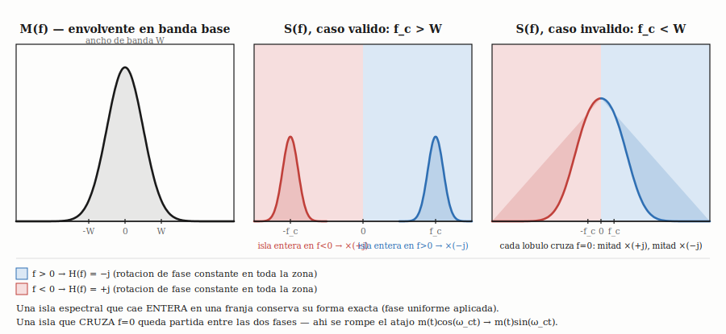

---
tags:
  - wiki/herramientas-matematicas
source_file: explicaciones_anki/unidad_02/carta_08_transformada_hilbert.md
curso: Sistemas de Comunicaciones
unidad: 2
---

# Transformada de Hilbert

> **Last verified:** 2025-11-16 | **Verified by:** [source — [[../../explicaciones_anki/unidad_02/carta_08_transformada_hilbert]]]

## Definicion

La Transformada de Hilbert $\hat{x}(t)$ de una señal $x(t)$ produce un **desfasaje de -90° para todas las frecuencias positivas** [source — [[../../explicaciones_anki/unidad_02/carta_08_transformada_hilbert]]]:

$$\hat{x}(t) = \mathcal{H}\{x(t)\} = \frac{1}{\pi} \text{P.V.} \int_{-\infty}^{\infty} \frac{x(\tau)}{t-\tau} d\tau$$

P.V. denota el **valor principal de Cauchy** para manejar la singularidad en $\tau = t$.

## Respuesta en Frecuencia

La Transformada de Hilbert es un sistema LTI con funcion de transferencia [source — [[../../explicaciones_anki/unidad_02/carta_08_transformada_hilbert]]]:

$$\boxed{H(f) = -j \cdot \text{sgn}(f) = \begin{cases} -j & f > 0 \\ 0 & f = 0 \\ +j & f < 0 \end{cases}}$$

Caracteristicas:
- $|H(f)| = 1$ para $f \neq 0$: **conserva la energia/amplitud**
- Fase = $-90°$ para $f > 0$, $+90°$ para $f < 0$
- Elimina la componente DC ($f = 0$)
- Es una convolucion con $\frac{1}{\pi t}$: $\hat{x}(t) = x(t) * \frac{1}{\pi t}$

> **¿Por que $\mathcal{H}\{\delta(t)\} = \frac{1}{\pi t}$, y por que convolucionar una señal temporal con $\frac{1}{\pi t}$ da su Transformada de Hilbert?** Estas dos preguntas en realidad son la misma cosa vista desde dos angulos, y se conectan por un teorema general de sistemas LTI (de Analisis de Señales y Sistemas, no algo especifico de Hilbert). [analysis]
>
> **Por que $\mathcal{H}\{\delta(t)\} = \frac{1}{\pi t}$**
>
> Se sale directo de meter $\delta(\tau)$ en la definicion:
> $$\mathcal{H}\{\delta(t)\} = \frac{1}{\pi}\,\text{P.V.}\int_{-\infty}^{\infty} \frac{\delta(\tau)}{t-\tau}\,d\tau$$
> Usando la propiedad de "cedazo" (*sifting*, en ingles) de la delta: $\int f(\tau)\delta(\tau)\,d\tau = f(0)$. Un cedazo es literalmente un tamiz/colador — la propiedad se llama asi porque multiplicar $f(\tau)$ por $\delta(\tau)$ y luego integrar "cuela" toda la funcion y deja pasar un unico valor, $f(0)$ (el punto donde esta centrada la delta), descartando el resto — igual que un colador de cocina deja pasar solo lo que entra por sus agujeros. Con $f(\tau) = \frac{1}{t-\tau}$ (fijo $t$, variable de integracion $\tau$):
> $$\mathcal{H}\{\delta(t)\} = \frac{1}{\pi}\cdot\frac{1}{t-0} = \frac{1}{\pi t}$$
> Valido para $t\neq0$ (la singularidad del P.V. esta en $\tau=t$, y evaluamos en $\tau=0$, que es distinto mientras $t\neq0$ — consistente con que $1/(\pi t)$ tambien es singular en $t=0$). No hace falta nada mas raro que la propiedad de cedazo que ya se uso mil veces con la delta.
>
> **Por que convolucionar con $\frac{1}{\pi t}$ da la Transformada de Hilbert de cualquier señal**
>
> Aca es donde entra el teorema general, no algo especifico de Hilbert: **para cualquier sistema LTI, la salida ante cualquier entrada $x(t)$ es la entrada convolucionada con la respuesta al impulso**, $y(t) = x(t)*h(t)$ donde $h(t)$ es la salida cuando la entrada es $\delta(t)$. Este teorema aplica directo aca porque la Transformada de Hilbert es un sistema LTI.
>
> La demostracion, para que no quede como caja negra: cualquier señal se puede escribir usando la propiedad de cedazo de la delta como
> $$x(t) = \int_{-\infty}^{\infty} x(\tau)\,\delta(t-\tau)\,d\tau$$
> Se aplica el operador $\mathcal{H}$ a ambos lados. Como $\mathcal{H}$ es **lineal**, entra dentro de la integral (que es, en el fondo, una suma continua):
> $$\mathcal{H}\{x(t)\} = \int_{-\infty}^{\infty} x(\tau)\,\mathcal{H}\{\delta(t-\tau)\}\,d\tau$$
> Y como $\mathcal{H}$ es **invariante en el tiempo**, si $\mathcal{H}\{\delta(t)\}=h(t)$ entonces $\mathcal{H}\{\delta(t-\tau)\}=h(t-\tau)$ (correr la entrada $\tau$ corre la salida $\tau$, por definicion de invarianza temporal). Sustituyendo:
> $$\hat x(t) = \int_{-\infty}^{\infty} x(\tau)\,h(t-\tau)\,d\tau = (x*h)(t)$$
> Con $h(t)=\frac{1}{\pi t}$ (lo que se calculo arriba), esto es exactamente $\hat x(t) = x(t)*\frac{1}{\pi t}$.
>
> **Por que no es circular**
>
> Las dos preguntas se contestan mutuamente si se miran mal (la segunda, aplicada a $x=\delta$, devuelve trivialmente la primera, porque $\delta * h = h$). Lo que rompe la circularidad es que la **primera** se calculo de forma independiente, directo de la integral P.V., sin usar la propiedad de convolucion para nada — asi que no es un razonamiento circular, es: (1) se calcula $h(t)$ una vez con la definicion cruda, (2) se usa el teorema general LTI para saber que ESE $h(t)$ sirve para cualquier señal de ahi en mas.
>
> *(Bonus, chequeo cruzado en frecuencia): $\mathcal{F}\{\text{sgn}(t)\}=\frac{-j}{\pi f}$ es un par estandar de Fourier; aplicando dualidad se obtiene $\mathcal{F}\{1/(\pi t)\} = -j\,\text{sgn}(f) = H(f)$ — confirma que $1/(\pi t)$ es efectivamente la respuesta al impulso cuya transformada es la $H(f)$ ya conocida.*

## Pares Fundamentales

$$\boxed{\mathcal{H}\{A\cos(2\pi f_0 t + \phi)\} = A\sin(2\pi f_0 t + \phi)}$$

$$\boxed{\mathcal{H}\{A\sin(2\pi f_0 t + \phi)\} = -A\cos(2\pi f_0 t + \phi)}$$

| Señal $x(t)$ | Transformada $\hat{x}(t)$ |
|--------------|---------------------------|
| $\cos(\omega t)$ | $\sin(\omega t)$ |
| $\sin(\omega t)$ | $-\cos(\omega t)$ |
| $\delta(t)$ | $1/(\pi t)$ |
| $1/(\pi t)$ | $-\delta(t)$ |

## Señal Analitica

La señal analitica se construye combinando la señal original con su transformada [source — [[../../explicaciones_anki/unidad_02/carta_08_transformada_hilbert]]]:

$$x_a(t) = x(t) + j\hat{x}(t)$$

Propiedad clave: su espectro solo contiene **frecuencias positivas**:

$$X_a(f) = \begin{cases} 2X(f) & f > 0 \\ X(0) & f = 0 \\ 0 & f < 0 \end{cases}$$

Esto elimina la redundancia de frecuencias negativas en señales reales.

> **¿Que significa esto y por que se llama "analitica"?** [analysis]
> - *La redundancia que elimina*: toda señal real tiene espectro con simetria hermitica, $X(-f)=X^*(f)$ — la mitad de frecuencias negativas no aporta informacion nueva, es el espejo conjugado de la positiva. La señal analitica empaqueta toda la informacion en un espectro de un solo lado, sin perder nada (siempre se recupera $x(t)=\text{Re}\{x_a(t)\}$).
> - *Por que hace falta para tener amplitud/fase instantanea bien definidas*: por Euler, $\cos(\omega t)=\tfrac12 e^{j\omega t}+\tfrac12 e^{-j\omega t}$ — un coseno real es la suma de dos fasores girando en direcciones opuestas, y por si solo es ambiguo (no se le puede asignar una unica direccion de giro). La Transformada de Hilbert cancela uno de los dos fasores y deja solo el que gira en sentido positivo, dando $x_a(t)=a(t)e^{j\phi(t)}$ con amplitud $a(t)=|x_a(t)|$ y fase $\phi(t)=\angle x_a(t)$ instantaneas bien definidas — de ahi sale su uso para envolvente en AM y frecuencia instantanea en FM.
> - *De donde sale el nombre*: si se extiende $t$ a un plano complejo, $x_a(t)$ es el valor de borde de una funcion **analitica/holomorfa** (derivable en sentido complejo, cumple Cauchy-Riemann) en el semiplano superior — condicion que se cumple *solo* cuando no hay frecuencias negativas, que es justo lo que garantiza la Transformada de Hilbert. Conecta con las relaciones de Kramers-Kronig (fuera del alcance del final, pero es el origen del nombre).

> **¿Que caracteristicas tiene la señal analitica? ¿Tiene alguna simetria, en tiempo o en frecuencia?** [analysis]
>
> *Aclaracion de vocabulario*: par, impar y hermitica son **invariancias bajo una transformacion** ($f\to-f$, o $f\to-f$ combinado con conjugar). La unilateralidad de $X_a(f)$ no es eso — es una **restriccion de soporte** (la funcion es identicamente cero en toda una semirrecta, $f<0$), no una invariancia. Categoria distinta de "simetria" en sentido clasico, aunque coloquialmente se hable asi.
>
> *En tiempo, en general NO tiene paridad*: para una señal real cualquiera (sin paridad particular), $x_a(t)$ no es par, no es impar, y tampoco cumple $x_a(-t)=x_a^*(t)$ en general — esa relacion (a veces vista en ejemplos con un coseno puro) solo se cumple si ademas $x(t)$ es par. Con un tono con fase, $x(t)=A\cos(\omega_0t+\phi)$, $\phi\neq0$: $x_a(t)=Ae^{j(\omega_0t+\phi)}$, y $x_a(-t)=Ae^{-j\omega_0t+j\phi}\neq x_a^*(t)=Ae^{-j\omega_0t-j\phi}$ salvo $\phi=0$.
>
> *En frecuencia, la unilateralidad estricta SI caracteriza completamente a la señal analitica* — no es solo una condicion necesaria, es un "si y solo si". Teorema: $z(t)$ es la señal analitica de alguna señal real $x(t)$ $\iff$ $Z(f)\equiv0$ para $f<0$. La ida es la construccion misma. La vuelta se demuestra asi: dado $z(t)$ complejo con $Z(f)=0$ para $f<0$, se define $x(t):=\text{Re}\{z(t)\}=\frac{z(t)+z^*(t)}{2}$. Usando la propiedad general $\mathcal{F}\{z^*(t)\}(f)=Z^*(-f)$: $X(f)=\frac12[Z(f)+Z^*(-f)]$. Para $f>0$: $-f<0\Rightarrow Z(-f)=0\Rightarrow Z^*(-f)=0$, entonces $X(f)=\frac12Z(f)$, o sea $Z(f)=2X(f)$. Para $f<0$: $Z(f)=0$ por hipotesis. Eso es exactamente la definicion de $X_a(f)$ — entonces $Z(f)=X_a(f)$ (salvo a lo sumo en $f=0$, punto de medida nula e irrelevante), y por lo tanto $z(t)=x_a(t)$.
>
> *Propiedad cuantitativa universal (no depende de paridad)*: la energia de la señal analitica es siempre el doble de la energia de la señal original, $E_{x_a}=2E_x$. Por Parseval: $E_{x_a}=\int|X_a(f)|^2df=\int_0^\infty|2X(f)|^2df=4\int_0^\infty|X(f)|^2df$, y como $x(t)$ es real, $E_x=\int|X(f)|^2df=2\int_0^\infty|X(f)|^2df$ (simetria hermitica, $|X(-f)|=|X(f)|$) — combinando, $E_{x_a}=2E_x$.
>
> *Distincion importante — no confundir $H(f)$ con $X_a(f)$*: $H(f)=-j\,\text{sgn}(f)$ (la respuesta en frecuencia del transformador de Hilbert) SI tiene modulo y fase bien definidos para $f<0$: $|H(f)|=1$, fase $+90°$. Pero $X_a(f)$ (el espectro de la señal analitica en si) es literalmente cero para $f<0$ — no una version atenuada o desfasada, ausencia total de contenido espectral.
>
> *¿Modulo indefinido o cero, para $X_a(f)$ con $f<0$? Modulo = 0 exacto; fase = indefinida (no cero)*. El modulo $|z|=\sqrt{\text{Re}(z)^2+\text{Im}(z)^2}$ es una funcion continua y de valor unico en todo el plano complejo, incluido el origen — $|0|=0$ sin ambiguedad. Lo que se degenera en el origen es solo el angulo: en la forma polar $z=re^{j\theta}$, el radio $r\geq0$ queda determinado sin ambiguedad para cualquier $z$ (incluido $r=0$), pero $\theta$ solo tiene sentido cuando $r>0$ — con $r=0$, todos los $\theta$ dan el mismo punto (el origen), asi que no hay forma de elegir uno. Fisicamente: no hay ninguna oscilacion a frecuencia negativa en $x_a(t)$, asi que no hay nada a lo que asignarle una fase, pero "cuanto hay" (el modulo) si tiene una respuesta clara: nada, cero.

## Aplicaciones en Comunicaciones

> **¿Por que al calcular $\mathcal{H}\{[1+0{,}8\cos(2\pi\cdot1000t)]\cos(2\pi\cdot10^6t)\}$ la envolvente $[1+0{,}8\cos(2\pi\cdot1000t)]$ queda intacta y solo el coseno de portadora pasa a seno?** No es una regla general de Hilbert sobre productos — $\mathcal{H}\{m(t)\cos(\omega_ct)\}\neq m(t)\mathcal{H}\{\cos(\omega_ct)\}$ en general. Es un teorema especifico, el de la **señal pasabanda/banda angosta**, valido bajo una condicion concreta. [analysis]
>
> **Enunciado**: si $m(t)$ tiene espectro limitado a $|f|<W$ (banda base "lenta") y $f_c>W$ (portadora mas alta que el ancho de banda de la envolvente), entonces $\mathcal{H}\{m(t)\cos(2\pi f_ct)\}=m(t)\sin(2\pi f_ct)$.
>
> **Por que**: $s(t)=m(t)\cos(2\pi f_ct)$ tiene espectro $S(f)=\frac12[M(f-f_c)+M(f+f_c)]$ (propiedad de modulacion de Fourier) — dos copias de $M(f)$, una centrada en $+f_c$ ocupando $(f_c-W,f_c+W)$ y otra en $-f_c$ ocupando $(-f_c-W,-f_c+W)$. Como $f_c>W$, cada isla queda **enteramente** de un solo lado de $f=0$. Dentro de la isla de arriba, $\text{sgn}(f)=+1$ en todos los puntos (constante), asi que $H(f)=-j$ multiplica uniformemente esa copia de $M(f)$ sin deformarla — idem la isla de abajo, multiplicada uniformemente por $+j$. Como $\text{sgn}(f)$ no cambia de signo *dentro* de ninguna isla, actua como constante ahi, no como algo que reordena la forma de $M(f)$. Rearmando (coincide exactamente con el par de Fourier de $m(t)\sin(2\pi f_ct)$), se llega a $\hat s(t)=m(t)\sin(2\pi f_ct)$ — la envolvente sale intacta porque nunca se toco, solo actuo sobre la portadora.
>
> **Chequeo en el ejemplo**: $W=1$kHz (envolvente con tono de 1000 Hz), $f_c=1$MHz — se cumple $f_c\gg W$ por seis ordenes de magnitud. Si en cambio $f_c$ fuera comparable o menor a $W$, las dos islas se solaparian cruzando $f=0$, $\text{sgn}(f)$ dejaria de ser constante dentro de cada una, y el atajo NO valdria — haria falta ir a la definicion general.
>
> **Es el mismo teorema que sostiene la formula de SSB** de la seccion 1 de abajo ($s_{SSB}(t)=m(t)\cos(\omega_ct)\mp\hat m(t)\sin(\omega_ct)$) — no es casualidad, es la misma propiedad de señal pasabanda aplicada.
>
> **Version grafica**: 
> El fondo de cada panel muestra que multiplicador de fase aplica $H(f)$ en cada zona (azul $f>0\to-j$, rojo $f<0\to+j$). Caso valido (centro): cada isla espectral de $S(f)$ cae entera en una sola franja → recibe una fase uniforme → conserva su forma exacta. Caso invalido (derecha, $f_c<W$): cada lobulo cruza $f=0$ y queda partido entre las dos fases → ahi se rompe el atajo.

### 1. Generacion de SSB (Banda Lateral Unica)

La señal SSB se genera usando la transformada de Hilbert [source — [[../../explicaciones_anki/unidad_02/carta_08_transformada_hilbert]]]:

$$s_{SSB}(t) = m(t)\cos(2\pi f_c t) \mp \hat{m}(t)\sin(2\pi f_c t)$$

- Signo $(-)$: USB (Upper Sideband)
- Signo $(+)$: LSB (Lower Sideband)

Ver [[../modulacion-analogica/modulacion-ssb]] para detalles.

### 2. Deteccion de Envolvente en AM

Para una señal AM $r(t)$, la envolvente se extrae via:

$$|r_a(t)| = |r(t) + j\hat{r}(t)|$$

### 3. Frecuencia Instantanea en FM

Para una señal FM $s(t)$, la frecuencia instantanea se calcula como:

$$f_i(t) = \frac{1}{2\pi}\frac{d}{dt}\angle s_a(t)$$

## Analogia

La Transformada de Hilbert es como ver una onda desde una posicion rotada 90°. Ambas vistas describen la misma onda pero desde perspectivas ortogonales. La señal analitica combina ambas vistas para una descripcion completa [analysis].

## Puntos Clave

- ✓ NO cambia el contenido de frecuencias, solo las fases [source — [[../../explicaciones_anki/unidad_02/carta_08_transformada_hilbert]]]
- ✓ $|H(f)| = 1$ para $f \neq 0$: conserva energia
- ✓ Solo definida para señales reales
- ✓ La señal analitica elimina frecuencias negativas

## Preguntas y Respuestas (dudas resueltas en sesion de estudio)

**¿A fines practicos, la Transformada de Hilbert se usa siempre solo sobre senos/cosenos?**

En la practica de este curso, casi seguro que si. En los 13 finales resueltos revisados (`exercises/finales/md/`) la palabra "Hilbert" no aparece ni una vez como parte de un calculo — los "$P_{SSB}$" que aparecen en varios ejercicios son la potencia de una banda lateral dentro de una señal AM/DSB, no señales SSB generadas via Hilbert. Todas las señales moduladoras de los finales son sumas de tonos senoidales. Como la Transformada de Hilbert es lineal, para $m(t)=\sum_i A_i\cos(\omega_i t+\phi_i)$ alcanza con aplicar el par fundamental termino a termino: $\hat m(t)=\sum_i A_i\sin(\omega_i t+\phi_i)$ — no hace falta la integral general (valor principal de Cauchy) para resolver un problema, esa forma es para la definicion/demostracion. Ojo: si algun dia dan una $m(t)$ que no sea suma de senos/cosenos, ahi si hace falta ir a $H(f)=-j\,\text{sgn}(f)$. [analysis]

**¿Cual es el espectro del seno y del coseno? ¿Uno de los dos es impar y por eso no tiene simetria hermitica?**

$$\cos(2\pi f_0 t) \leftrightarrow \frac{1}{2}\big[\delta(f-f_0)+\delta(f+f_0)\big] \quad\text{— real y par}$$
$$\sin(2\pi f_0 t) \leftrightarrow -\frac{j}{2}\delta(f-f_0)+\frac{j}{2}\delta(f+f_0) \quad\text{— imaginario puro e impar}$$

Correccion importante: la **simetria hermitica** ($X(-f)=X^*(f)$) se cumple para **toda** señal real, sin excepcion — no depende de que la señal sea par o impar en el tiempo. Demostracion corta: $X^*(f) = \left(\int x(t)e^{-j2\pi ft}dt\right)^* = \int x^*(t)e^{j2\pi ft}dt \overset{x\text{ real}}{=} \int x(t)e^{j2\pi ft}dt = X(-f)$ — el argumento solo usa que $x^*(t)=x(t)$ (real), nunca paridad. El seno tambien cumple $X(-f)=X^*(f)$ (se puede verificar directo con la formula de arriba). Lo que si depende de la paridad es una propiedad *distinta*, mas especifica: real+par$\to$espectro real y par (coseno); real+impar$\to$espectro imaginario puro e impar (seno); real sin paridad definida$\to$espectro complejo con parte real par + parte imaginaria impar. Las tres son casos particulares de simetria hermitica, no excepciones a ella. [analysis]

**¿El concepto de señal analitica se relaciona con las funciones FRP (Funcion Real Positiva, de Teoria de Circuitos)? ¿Son conceptos fisicos o matematicos?**

*(Asumiendo que FRP = Funcion Real Positiva — no confirmado, no aparece en el material del curso.)* La conexion es real: una FRP caracteriza que funciones $Z(s)$ son fisicamente realizables como impedancia de una red pasiva (R, L, C), via el teorema de Brune. La condicion matematica de fondo es la misma familia que la señal analitica: ambas dependen de que una funcion sea analitica/holomorfa en un semiplano (la señal analitica en el semiplano superior del tiempo complejo; la FRP en el semiplano derecho de $s$). En ambos casos esa analiticidad fuerza una relacion tipo Hilbert entre parte real e imaginaria en el eje de frecuencias — en fisica son las relaciones de Kramers-Kronig, en teoria de circuitos las relaciones de Bode ganancia-fase. Son conceptos **matematicos** (analisis complejo) que se usan porque capturan una restriccion **fisica**: causalidad (señal analitica) o realizabilidad pasiva (FRP). El hilo comun: un sistema fisico causal/realizable impone automaticamente una relacion de Hilbert entre las partes real e imaginaria de su respuesta en frecuencia. [analysis]

**¿Las señales en comunicaciones son reales o complejas? Me confunde con constelaciones y OFDM.**

Las señales **fisicas** (las que viajan por cable o aire) son siempre reales. Los complejos son una herramienta matematica de representacion. El puente es la **envolvente compleja**: cualquier señal real pasabanda $s(t)$ se escribe como $s(t) = \text{Re}\{\tilde{s}(t) \cdot e^{j2\pi f_c t}\}$, donde $\tilde{s}(t) = I(t) + jQ(t)$ es compleja y contiene toda la info de modulacion. Las constelaciones viven en ese plano complejo I-Q: cada simbolo es un punto $I_k + jQ_k$. En OFDM, la IFFT genera muestras complejas en tiempo, que luego se separan en parte real/imaginaria y se modulan en cuadratura para producir la señal real transmitible. Parseval ($\int |x(t)|^2 dt = \int |X(f)|^2 df$) funciona igual para señales reales y complejas porque $|z|^2 = z \cdot z^*$ siempre da un real positivo. La forma generalizada $\int x y^* = \int X Y^*$ usa el conjugado justamente para manejar señales complejas. [analysis]

**¿Entonces en el tiempo son reales y en frecuencia complejas?**

No exactamente. En el dominio del tiempo tambien trabajamos con señales complejas: la envolvente compleja $\tilde{s}(t)$, la señal analitica $x_a(t)$, y los simbolos de constelacion existen en tiempo y son complejos. En frecuencia, $X(f)$ es complejo pero con restriccion: si $x(t)$ es real entonces $X(-f) = X^*(f)$ (simetria hermitica). La mitad negativa del espectro es redundante — de ahi que la señal analitica pueda eliminar las frecuencias negativas sin perder informacion. [analysis]

**¿Como es que Hilbert "inventa" una parte compleja?**

No la inventa de la nada. La informacion ya estaba en la señal real, pero "oculta" en las frecuencias negativas. Toda señal real tiene espectro con simetria hermitica: $X(-f) = X^*(f)$. Las frecuencias negativas son un espejo redundante de las positivas. La transformada de Hilbert, con $H(f) = -j \cdot \text{sgn}(f)$, es el mecanismo para cancelar ese espejo: al formar $x_a(t) = x(t) + j\hat{x}(t)$, las frecuencias negativas se cancelan (las $j \cdot (+j)$ de la parte imaginaria son $-1$ veces la original) y las positivas se duplican. El resultado es un espectro de un solo lado y una señal compleja pura. Lo que Hilbert "inventa" es la parte imaginaria exacta para lograr esa cancelacion destructiva en las negativas y constructiva en las positivas. [analysis]

**¿"Espectro simetrico" se refiere a simetria hermitica, no? ¿Que es el conjugado?**

Si, exactamente. Simetria hermitica: $X(-f) = X^*(f)$, donde $X^*(f)$ es el **complejo conjugado** (cambia el signo de la parte imaginaria). No significa $X(-f) = X(f)$ (eso seria simetria par). Implica: magnitud par ($|X(-f)| = |X(f)|$) y fase impar ($\angle X(-f) = -\angle X(f)$). Las partes real e imaginaria no son simetricas entre si a secas — por eso necesitas el conjugado: lo que aparece a $-f$ es el espejo con fase invertida. De ahi la redundancia que Hilbert explota. [analysis]

**¿La Transformada de Hilbert existe para todas las señales?**

No. Requisitos: (1) la señal debe ser **real** — no esta definida para señales que ya son complejas; (2) debe tener Transformada de Fourier; (3) la componente DC ($f = 0$) se anula porque $H(0) = 0$. Para las señales tipicas del curso (senos, cosenos, sumas de tonos) siempre existe sin problemas. [analysis]

**¿La Transformada de Hilbert de una señal real siempre es no-real (compleja)?**

Al reves: **siempre es real**. $\mathcal{H}\{\cos\} = \sin$, $\mathcal{H}\{\sin\} = -\cos$ — ambas son señales reales. La Transformada de Hilbert no convierte una señal real en compleja: solo la desfasa 90°. Lo que es complejo es la **señal analitica** $x_a(t) = x(t) + j\hat{x}(t)$, que combina la señal original (parte real) con su Hilbert (parte imaginaria). La confusion es comun: Hilbert = solo desfasaje, no genera numeros complejos por si mismo; la señal analitica = Hilbert + original, esa si es compleja. [analysis]

**¿Existe la antitransformada de Hilbert?**

Si. La antitransformada es simplemente la transformada con signo negativo: $\mathcal{H}^{-1} = -\mathcal{H}$. Aplicar Hilbert dos veces devuelve la señal original con signo invertido: $\mathcal{H}\{\mathcal{H}\{x(t)\}\} = -x(t)$. Esto es consistente con $H(f) = -j \cdot \text{sgn}(f)$: encadenar dos Hilbert en frecuencia da $(-j \cdot \text{sgn}(f))^2 = -1$, que en tiempo significa $-x(t)$. Por lo tanto, para recuperar la señal: $\mathcal{H}^{-1}\{y\} = -\mathcal{H}\{y\}$. [analysis]

## Ver tambien

- [[../herramientas-matematicas/teorema-convolucion]]
- [[../modulacion-analogica/modulacion-ssb]]
- [[../introduccion/modelo-shannon]]
